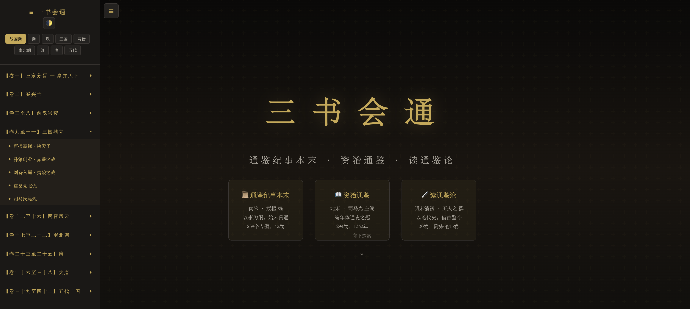
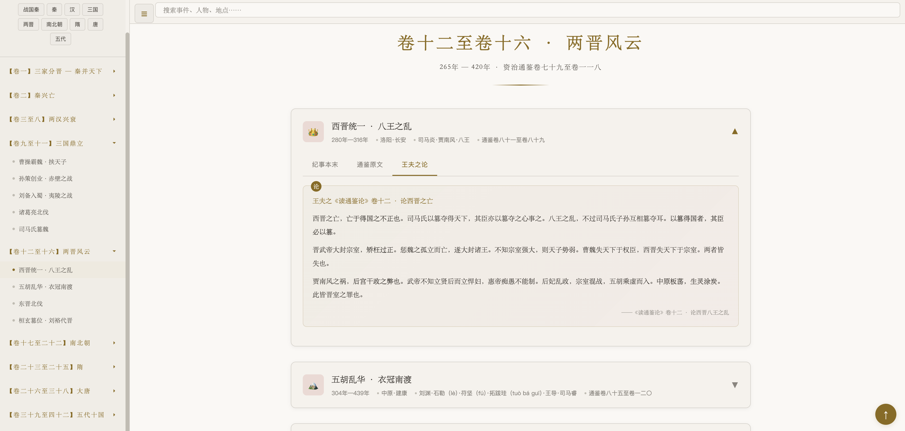

# 三书会通

**以《通鉴纪事本末》为纲，《资治通鉴》为据，《读通鉴论》为鉴——三书合一，交互阅读。**

## 为什么做这个

通鉴按编年叙事，同一事件散落于不同年份的卷帙之中，读者难以把握来龙去脉。袁枢《通鉴纪事本末》以事件为线索重新编排，恰好弥补了这一缺陷。而王夫之《读通鉴论》借古论今，每有精辟之见，却散见于三十卷之中，不易系统参照。

遂将三书合为一册：**纪事本末理清脉络，通鉴原文夯实根据，船山议论引发思考**。一个 HTML 文件，无需服务器，下载即可本地浏览。

## 预览

| 深色主题 | 浅色主题 | 详情展开 |
|:-------:|:-------:|:-------:|
|  |  |  |

**🔗 在线体验：https://niorw.github.io/tongjian-san-shu/**

## 内容

覆盖战国至五代（前403年—960年）的 **43个核心历史事件**：

| 时代 | 章节 | 时间跨度 | 代表事件 |
|------|:----:|----------|----------|
| 战国·秦 | 7 | 前403—前207 | 三家分晋、商鞅变法、秦灭六国 |
| 两汉 | 9 | 前206—220 | 楚汉之争、王莽篡汉、党锢之祸 |
| 三国 | 5 | 190—280 | 赤壁之战、诸葛亮北伐、司马氏篡魏 |
| 两晋 | 4 | 265—420 | 八王之乱、五胡乱华、东晋北伐 |
| 南北朝 | 4 | 420—589 | 孝文帝改革、侯景之乱 |
| 隋 | 3 | 581—618 | 开皇之治、隋末群雄 |
| 唐 | 8 | 618—907 | 贞观之治、安史之乱、藩镇割据 |
| 五代 | 3 | 907—960 | 石敬瑭割燕云、柴荣之治 |

每个事件包含三个视角：

- 📜 **纪事本末** — 袁枢之编排，事件始末一目了然
- 📖 **通鉴原文** — 司马光之笔，史料原文忠实呈现
- 🖋 **王夫之论** — 船山先生之眼，史论观点鞭辟入里

## 功能

- 🌓 深色 / 浅色主题切换（奶白色高级色系）
- 📑 左侧导航栏 + 朝代快捷跳转
- 🔍 全文搜索（事件、人物、地点）
- 📱 响应式布局，移动端可用
- 🏷 时间 / 地点 / 人物 / 事件标签
- 📜 阅读进度条
- 🎯 点击展开详情，三栏标签页切换阅读

## 使用

单个 HTML 文件，无需服务器、无需安装——

**在线：** 直接访问上方链接

**本地：** 下载 `index.html`，浏览器打开即可

```bash
# 或者克隆整个仓库
git clone https://github.com/niorw/tongjian-san-shu.git
# 浏览器打开 index.html
```

## 致谢

- [资治通鉴](https://zh.wikisource.org/wiki/資治通鑑) — 司马光
- [通鉴纪事本末](https://zh.wikisource.org/wiki/通鑑紀事本末) — 袁枢
- [读通鉴论](https://zh.wikisource.org/wiki/讀通鑑論) — 王夫之
